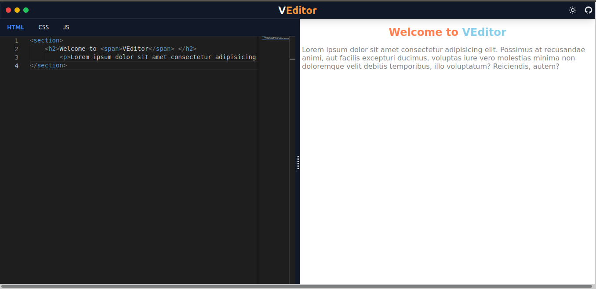

# VEditor

I attempt to clone codepen.io using Vue 3, TailwindCss, Typescript and Monaco editor.



## Usage

```bash
# Install dependencies
$ npm install

# Vite preview
$ npm run dev

# Compiles and minifies for production
$ npm run build

```

## Built with

- [Vue 3](https://v3.vuejs.org/)
- [Vite](https://vitejs.dev/)
- [Monaco Editor](https://github.com/microsoft/monaco-editor)
- [Tailwind CSS](https://tailwindcss.com/)
- [Netlify](https://www.netlify.com/)

## License

Licensed under the [MIT license](https://opensource.org/licenses/MIT).
